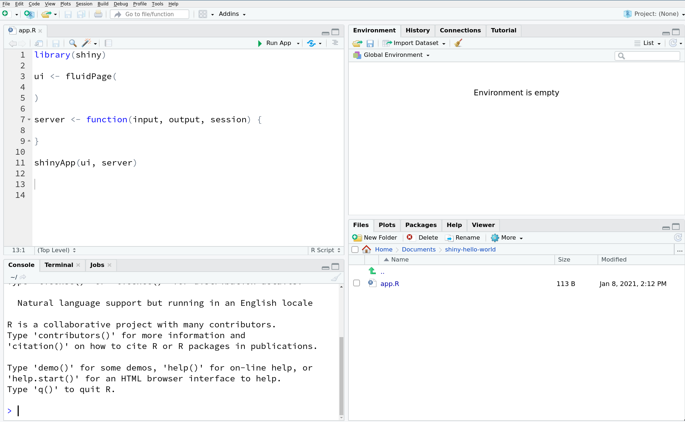

# Introduction to R-Shiny

## Structure of a Shiny App
Shiny apps are run from a single script `app.R` that is made up of three parts:

* A user interface object: The user interface object controls how your Shiny app **looks**.
* A server function: The server function controls how your Shiny app **runs**.
* A `shinyApp` function: The `shinyApp` function **builds** your Shiny app.

The user interface and server components of a Shiny app can be stored in separate files, `ui.R` and `server.R`, or together in a single file, `app.R`. It will be easier for us to work with a single file during this tutorial, so we will use the unified `app.R` structure for this tutorial.

A Shiny app without any content looks like:

```{r shiny-skeleton, eval=FALSE}
library(shiny)

ui <- 

server <- 

shinyApp(ui = ui, server = server)
 ```
 
 Don't try to run this app as it will fail since the `ui` and `server` content has not been populated yet. Instead we are going to use this as a skeleton to begin building our first Shiny app!

## Building Your First Shiny App

Lets begin by building a very simple app to help us build our intuition about how Shiny apps work.

Create a new directory called `shiny-hello-world` in a directory of your choice. From within that directory create a new file called `app.R`.

Within `app.R` we are going to add the three components we need for a working Shiny app, `ui`, `server`, and `shinyApp` that we showed the code for above, except now we will populate them so your `app.R` can successfully run.

Your `app.R` should look like:

```{r shiny-skeleton-empty, eval=FALSE}
library(shiny)

ui <- fluidPage(
  
)

server <- function(input, output, session) {
  
}

shinyApp(ui, server)
```

If you are using R-Studio, rather than typing all of the above code into your `app.R` file, you can type `shinyapp` and then press <kbd>Shift</kbd> + <kbd>Tab</kbd> and the Shiny app skeleton will be generated automatically.

> When developing any new Shiny app it is good practice to use the automatically generated boilerplate template, this will ensure you are starting from a working app.

:::puzzle
When developing any new Shiny app it is good practice to use the automatically generated boilerplate template, this will ensure you are starting from a working app.
:::

Now lets try running this new Shiny app. 


